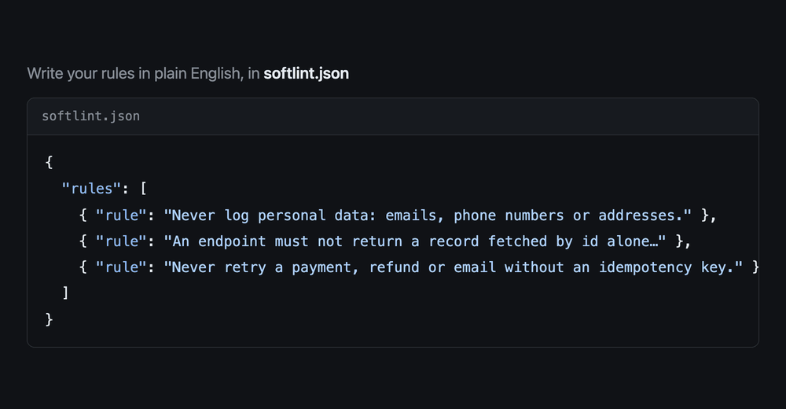

<p align="center">
  
</p>

<h1 align="center">softlint</h1>
<p align="center"><strong>Enforce the rules a linter can't.</strong></p>

<p align="center">
  Plain-English rules, checked on every pull request, in any language.<br>
  <sub>11 of 11 violations caught and 0 of 11 look-alikes flagged in <a href="examples">the examples</a> · about $0.001 per pull request · a few seconds per run</sub>
</p>



## Why

Some of your most important rules can't be checked by a linter, because they're about meaning, not syntax:

- "An endpoint must check that the requester owns the record it returns."
- "Never retry a refund without an idempotency key."
- "Never log a customer's email or phone number."

Today they live in onboarding docs and in review comments you've written fifty times. softlint enforces them. It sends each changed piece of a pull request, with each rule, to [Jev](https://typesafe.ai), a model that answers yes/no questions with a probability. When Jev is confident a change breaks a rule, softlint marks the exact line.

It is **language agnostic**: it reads the diff, so TypeScript, Python, Go, SQL and anything else work the same.

## Setup (2 minutes)

1. Add your [Jev API key](https://typesafe.ai) as a repository secret named `JEV_API_KEY`.
2. Add `.github/workflows/softlint.yml`:

   ```yaml
   name: softlint
   on: pull_request
   permissions:
     contents: read
   jobs:
     softlint:
       runs-on: ubuntu-latest
       steps:
         - uses: blazejkustra/softlint@v1
           with:
             jev-api-key: ${{ secrets.JEV_API_KEY }}
   ```

3. Add `softlint.json` with your rules:

   ```json
   {
     "$schema": "https://raw.githubusercontent.com/blazejkustra/softlint/main/softlint.schema.json",
     "rules": [
       {
         "rule": "Every endpoint that reads one user's data must check that the requester may access that record. Looking a record up by its id alone breaks this rule."
       },
       {
         "rule": "Migrations must not break the code that is already deployed: renaming or dropping a column, or adding a NOT NULL column without a default, breaks this rule.",
         "files": ["**/migrations/**"]
       }
     ]
   }
   ```

## CLI

Add your Jev API key to your environment as `JEV_API_KEY`, then check your changes before you push:

```sh
git diff main | npx @blazejkustra/softlint
```

Add `--all` to see every score while you tune a rule, and `--threshold 0.9` to be stricter. Exit code `1` means it found something.

## Good rules

Say what the violation looks like in code, scope it with `files`, and leave anything a linter can check to your linter. See [`examples/`](examples) for 11 tested rules.

## License

MIT
